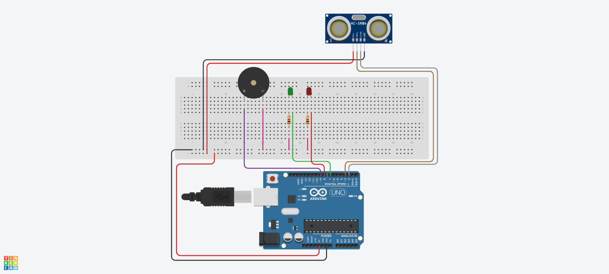

# Sensor-de-Estacionamento-com-Arduino

Este projeto simula um **sensor de estacionamento** inteligente usando o Arduino e o Tinkercad. A ideia é detectar a distância de obstáculos e emitir alertas visuais e sonoros para evitar colisões durante manobras.

## 🔧 Componentes Utilizados

- Arduino UNO (ou compatível)
- Sensor Ultrassônico HC-SR04
- 1 LED Verde (indica espaço livre)
- 1 LED Vermelho (indica perigo)
- 1 Buzzer (emite som de alerta)
- Jumpers
- Protoboard

## ⚙️ Funcionamento

- O **sensor ultrassônico** mede a distância entre o veículo e um obstáculo.
- Se a distância for **menor ou igual a 10 cm**, o sistema:
  - Acende o LED vermelho.
  - Ativa o buzzer com variação de frequência (som intermitente).
- Se a distância for **maior que 10 cm**, o sistema:
  - Acende o LED verde.
  - Desliga o buzzer.

O valor de 10 cm é configurável e pode ser ajustado na variável `distancia_carro`.

## 🧠 Estrutura do Código

- `sensor_morcego()`: Função que calcula a distância com o sensor ultrassônico.
- `tocaBuzzer()`: Gera um som com frequência variada utilizando a função `tone()`.
- Uso de `Serial.print()` para monitoramento via monitor serial do Arduino.

## 🚀 Como Usar

1. Faça upload do código no Arduino.
2. Monte o circuito conforme a tabela de pinos.
3. Aponte o sensor para um objeto e observe os LEDs e o som do buzzer.
4. Use o **Monitor Serial** (9600 baud) para acompanhar as distâncias medidas.

---

Projeto didático para estudos de sensores com Arduino.
